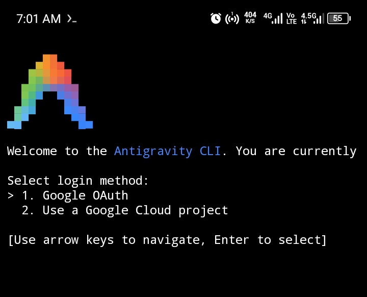

# 🚀 Mobile Antigravity

> Run Google's **Antigravity CLI** (`agy`) natively on any Android phone — no PC, no root required.

<p align="center">
  
</p>

---

## What is this?

[Google Antigravity](https://antigravity.google) is Google's AI coding agent CLI. This guide shows you how to run it directly on your Android phone using **Termux** + **proot-distro** (Ubuntu environment) — no root needed, no laptop needed.

---

## 📋 Prerequisites

- Android phone (any modern Android 7+)
- [Termux](https://f-droid.org/en/packages/com.termux/) installed from **F-Droid** (not Play Store)
- A Google account (for OAuth login)
- Internet connection

> ⚠️ **Important:** Install Termux from [F-Droid](https://f-droid.org/en/packages/com.termux/), not the Play Store. The Play Store version is outdated and will cause issues.

---

## ⚡ One-Click Setup

Paste this single command in Termux to do everything automatically:

```bash
curl -fsSL https://raw.githubusercontent.com/mobileantigravity/Mobile-Antigravity/main/setup.sh | bash
```

Or follow the manual step-by-step guide below.

---

## 🛠️ Manual Step-by-Step Guide

### Step 1 — Update Termux packages

Open Termux and run:

```bash
pkg update
```

> Press `Y` when prompted. This may take a minute.

---

### Step 2 — Install proot-distro

```bash
pkg install proot-distro
```

proot-distro lets you run a full Linux distro (Ubuntu) inside Termux without root.

---

### Step 3 — Install Ubuntu

```bash
proot-distro install ubuntu
```

This downloads a minimal Ubuntu environment (~100MB). Wait for it to finish.

---

### Step 4 — Login to Ubuntu

```bash
proot-distro login ubuntu
```

Your prompt will change — you're now inside Ubuntu! All following commands run here.

---

### Step 5 — Update Ubuntu packages

```bash
apt update
```

---

### Step 6 — Install curl and git

```bash
apt install curl git -y
```

---

### Step 7 — Install Antigravity CLI

```bash
curl -fsSL https://antigravity.google/cli/install.sh | bash
```

This downloads and installs the `agy` binary to `~/.local/bin/`.

---

### Step 8 — Verify installation

```bash
~/.local/bin/agy --version
```

You should see the Antigravity CLI version number printed.

---

### Step 9 — Add `agy` to your PATH

```bash
export PATH="/root/.local/bin:$PATH"
echo 'export PATH="/root/.local/bin:$PATH"' >> ~/.bashrc
source ~/.bashrc
```

Now you can just type `agy` instead of the full path.

---

### Step 10 — Run Antigravity!

```bash
agy
```

You'll see the Antigravity welcome screen. Select **Google OAuth** to log in with your Google account.

---

## 📸 What it looks like

When it works, you'll see:

```
Welcome to the Antigravity CLI. You are currently

Select login method:
> 1. Google OAuth
  2. Use a Google Cloud project

[Use arrow keys to navigate, Enter to select]
```

Use the arrow keys to select **Google OAuth** and hit Enter. Follow the browser link to authenticate.

---

## 🔄 Returning Users

Every time you open a new Termux session:

```bash
proot-distro login ubuntu
agy
```

That's it. Your PATH is already saved in `.bashrc`.

---

## ❓ Troubleshooting

| Problem | Fix |
|--------|-----|
| `pkg update` fails | Make sure you installed Termux from F-Droid, not Play Store |
| `agy: command not found` | Re-run `source ~/.bashrc` or use `~/.local/bin/agy` |
| Ubuntu install is slow | Normal — it's ~100MB, give it time |
| OAuth page won't open | Manually copy the URL and open it in your browser |
| `apt update` fails inside Ubuntu | Check your internet connection and try again |

---

## 🤝 Contributing

Found a better way? Got it working on iOS via iSH? Open a PR!

---

## 📄 License

MIT — do whatever you want with this.

---

<p align="center">Made with ❤️ for the mobile developer community</p>
